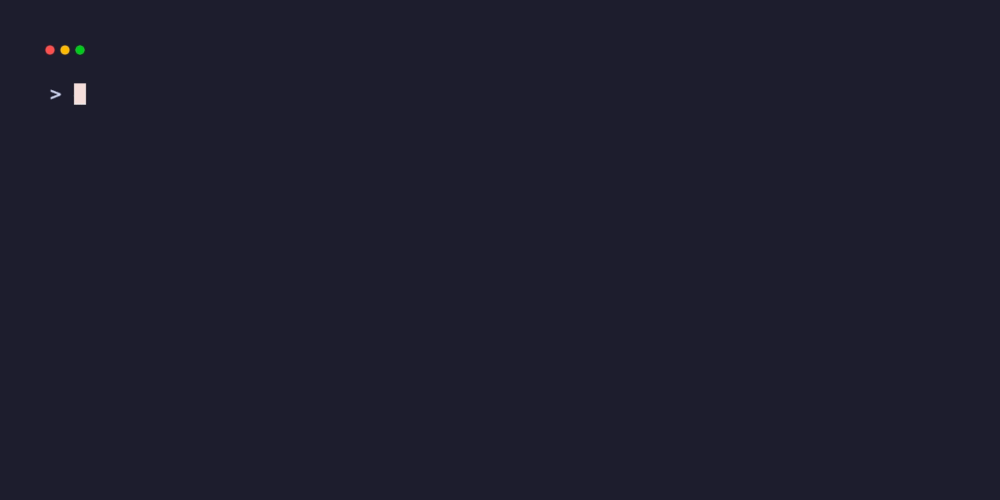

# juga (주가) 📈
[🇺🇸 English](README.md) | **🇰🇷 한국어**

> 한국 실시간 주가 확인을 위한 간단한 CLI 도구

복잡한 설정 없이 별칭(Alias)과 퍼지 검색(Fuzzy Search)을 통해 KOSPI/KOSDAQ 시장 데이터를 터미널에서 즉시 확인할 수 있습니다.

## ⚡️ 목적
- **Simple:** 복잡한 설정이나 API 키 없이, 실행 파일 하나로 즉시 사용 가능.
- **Smart Search:** `005930`을 외울 필요 없이 `juga 삼전`으로 검색. 검색 결과가 여러 개일 경우 **인터렉티브 피커**를 통해 원하는 종목을 선택할 수 있습니다.
- **결정적 접두사 (Prefix):** 기호(`@`, `:`, `#`, `/`)를 사용하여 특정 조회 모드를 강제할 수 있습니다.
- **Clean Output:** 가격과 변동폭 등 꼭 필요한 정보만 표기.
- **Mix & Match:** 종목명, 6자리 코드, 별칭을 원하는 대로 섞어서 여러 종목을 한 번에 조회.

## 📥 설치 방법

### 방법 1: Go Install (권장)
[Go 1.25](https://go.dev/dl/) 버전으로 개발.

**macOS / Linux:**
```bash
go install github.com/ericyhkim/juga/cmd/juga@latest

# Go bin 경로를 PATH에 추가 (영구 적용을 위해 ~/.zshrc 또는 ~/.bashrc에 추가)
export PATH=$PATH:$(go env GOPATH)/bin
```

**Windows (PowerShell):**
```powershell
go install github.com/ericyhkim/juga/cmd/juga@latest

# 명령어를 찾을 수 없는 경우 PATH 추가:
$env:Path += ";$(go env GOPATH)\bin"
```

### 방법 2: 직접 빌드
소스 코드를 수정하거나 특정 브랜치에서 빌드하고 싶은 경우:

**macOS / Linux:**
```bash
git clone https://github.com/ericyhkim/juga.git
cd juga

# 로컬 소스를 빌드하고 Go bin 폴더에 자동으로 설치합니다.
go install ./cmd/juga
```

**Windows (PowerShell):**
```powershell
git clone https://github.com/ericyhkim/juga.git
cd juga

# 로컬 소스를 빌드하고 Go bin 폴더에 자동으로 설치합니다.
go install ./cmd/juga
```

### 🗑️ 삭제 방법
**macOS / Linux:**
```bash
# 1. 바이너리 삭제
rm $(go env GOPATH)/bin/juga || sudo rm /usr/local/bin/juga

# 2. 설정 및 데이터 삭제 (XDG 표준 준수)
rm -rf ~/.config/juga ~/.local/share/juga ~/.cache/juga
```

**Windows:**
`juga.exe` 파일을 삭제하고 다음 폴더들을 제거하세요:
- `%APPDATA%\juga` (설정)
- `%LOCALAPPDATA%\juga` (데이터 및 캐시)

## 🏎️ 빠른 시작
```bash
# 1. 이름, 코드, 별칭을 섞어서 조회
juga sam 005380 SK하이닉스

# 2. 접두사를 사용하여 정확하게 조회
juga @my-portfolio  # 포트폴리오 강제
juga :sam           # 별칭 강제
juga #005930         # 종목 코드 강제
juga /카카오        # 퍼지 검색 강제 (인터렉티브 피커 표시)

# 3. 종목 코드를 모를 땐 검색
juga find 삼전

# 4. 별칭 설정
juga alias set sam 005380
```

## 💻 명령어 (Commands)
| 명령어 | 단축어 | 설명 |
| :--- | :--- | :--- |
| `juga [names...]` | - | **빠른 조회.** 실시간 시세를 조회합니다. 접두사(`@`, `:`, `#`, `/`)를 지원합니다. |
| `juga alias set <nick> <tgt>` | `a set` | 별칭을 등록합니다. (예: `juga a set 삼전 005930`) |
| `juga alias edit` | `a edit`, `a e` | 모든 별칭을 텍스트 에디터에서 엽니다. |
| `juga alias list` | `a list`, `a ls` | 저장된 모든 별칭 목록을 보여줍니다. |
| `juga alias remove <nick>` | `a remove`, `a rm` | 별칭을 삭제합니다. |
| `juga portfolio set <name> [s...]` | `p set` | 포트폴리오(종목 그룹)를 생성하거나 덮어씁니다. |
| `juga portfolio edit <name>` | `p edit`, `p e` | 포트폴리오를 텍스트 에디터에서 수정합니다. |
| `juga portfolio list` | `p list`, `p ls` | 저장된 모든 포트폴리오를 보여줍니다. |
| `juga portfolio remove <name>` | `p remove`, `p rm` | 포트폴리오를 삭제합니다. |
| `juga find <query>` | `f`, `search` | 마스터 종목 리스트에서 종목을 퍼지 검색합니다. |
| `juga update` | `up` | 최신 종목 리스트를 가져와서 업데이트합니다. (네이버 금융 크롤링) |
| `juga market` | `m` | KOSPI/KOSDAQ 지수 정보를 상세하게 보여줍니다. |

## 🛠 기술 스택 (Tech Spec)
- **Language:** Go (Golang)
- **CLI Framework:** `spf13/cobra`
- **UI/Styling:** `charmbracelet/lipgloss`, `charmbracelet/huh` (인터렉티브 피커)
- **Fuzzy Matching:** `sahilm/fuzzy`
- **Data Source:** 네이버 금융 실시간 폴링 API (JSON).

## 📂 파일 및 설정
`juga`는 **XDG Base Directory Specification**을 따릅니다:

| 파일 | 종류 | 기본 경로 (Linux/macOS) | 환경 변수 (Override) |
| :--- | :--- | :--- | :--- |
| `aliases.json` | 설정 | `~/.config/juga/aliases.json` | `JUGA_CONFIG_HOME` |
| `portfolios.json` | 설정 | `~/.config/juga/portfolios.json` | `JUGA_CONFIG_HOME` |
| `master_tickers.csv` | 데이터 | `~/.local/share/juga/master_tickers.csv` | `JUGA_DATA_HOME` |
| `cache.json` | 캐시 | `~/.cache/juga/cache.json` | `JUGA_CACHE_HOME` |

> **참고:** Windows에서는 기본적으로 `%APPDATA%\juga` (설정) 및 `%LOCALAPPDATA%\juga` (데이터/캐시)를 사용합니다.

- **종목 해결 로직**:
  1. **접두사 확인**: 입력값이 접두사(`@`, `:`, `#`, `/`)로 시작하면 해당 모드로 강제 조회합니다.
  2. **포트폴리오 확인**: 접두사가 없으면 저장된 포트폴리오인지 확인합니다.
  3. **별칭 확인**: `aliases.json`에서 정확히 일치하는 별칭이 있는지 확인합니다.
  4. **코드 확인**: 유효한 6자리 종목 코드인지 확인합니다.
  5. **퍼지 검색**: `master_tickers.csv`에서 검색합니다. 결과가 여러 개면 **인터렉티브 피커**를 보여줍니다.
  6. **데이터 조회 및 출력**.

## 🎨 Demo



## ❓ 문제 해결
- **"Could not find stock..."**
  종목 리스트가 오래되었을 수 있습니다. `juga update` 명령어로 갱신해보세요.
- **원하지 않는 종목이 계속 검색되나요?**
  오타나 유사한 종목명으로 인해 잘못된 결과가 캐싱되었을 수 있습니다.
  - **해결 1 (추천):** `juga alias set <이름> <코드>` 명령어로 별칭을 직접 등록하세요.
  - **해결 2 (초기화):** `juga clean` 명령어로 검색 기록과 종목 데이터베이스를 초기화하세요.
